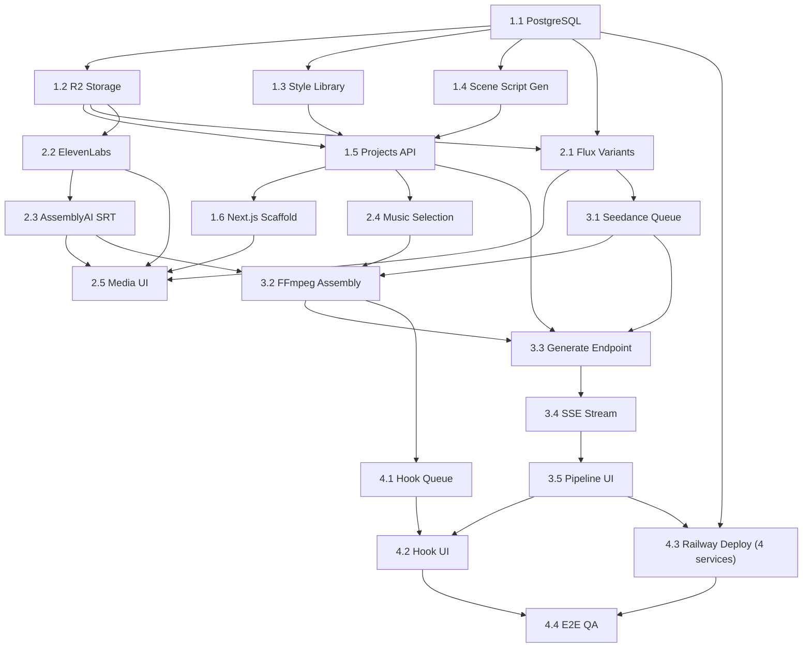

# AI Cartoon Generator Implementation Plan

Based on [AI_Cartoon_Generator_Dev_Scope.md](../../../../Users/Shah%20Durran/Downloads/AI_Cartoon_Generator_Dev_Scope.md). Single-user tool built on top of the existing Node.js backend -- extend, do not rewrite.

## Decisions

- **Hosting:** single Railway project with 4 services -- Next.js frontend, Node backend, PostgreSQL plugin, Redis plugin. No Vercel. Single-user internal tool does not need Vercel's global edge CDN, and co-locating FE + BE + DB + Redis in one region simplifies env vars, CORS, SSE, and service-to-service calls
- **Frontend:** new Next.js 14 (App Router) on Railway -- the existing React/Vite frontend is **not** extended for this tool
- **Backend:** extend the existing Node.js/Express backend, deploy on Railway
- **Database:** PostgreSQL (Railway plugin) replaces all JSON file storage for structured data (projects, scenes, styles, jobs, music selections, hook variants). Uses `pg` with a lightweight repository layer; raw SQL migrations. No ORM
- **Blob storage:** Cloudflare R2 for all generated binaries (images, audio, video, SRT). Postgres stores R2 keys and metadata only. Local file system used only as FFmpeg temp scratch
- **Video model:** Fal.AI Seedance `fal-ai/bytedance/seedance/v1/pro/image-to-video` via `VIDEO_MODEL_ID` env var (swappable to Seedance 2.0 or Kling later with no code change)
- **Voice:** ElevenLabs official `elevenlabs` npm package replaces the current [voiceService.js](src/services/voiceService.js) genaipro/fal providers
- **Queue:** reuse existing Bull + Redis setup; add two new queues (`seedance-video-queue`, `hook-generator-queue`)
- **Out of scope (deferred vs. original gap plan):** auth/roles, team features (tasks, calendar, review dashboard), cost tracking UI, prompt version history, model abstraction layer, backup/restore automation, staging environment, RunPod GPU rendering. Single-user tool does not need them

## Reuse Map -- Existing Backend Components

These are already built and are reused as-is (or lightly extended):

- [claudeService.js](src/services/claudeService.js) -- extended to return structured scene JSON
- [imageService.js](src/services/imageService.js) -- Fal.AI Flux already integrated; extend to return 3-4 variants per prompt
- [assemblyAIService.js](src/services/assemblyAIService.js) -- already produces word-level timestamps; add SRT formatter
- [videoProcessingService.js](src/services/videoProcessingService.js) -- FFmpeg pipeline; add subtitle `force_style` customization and concat-with-music path
- [musicLibraryController.js](src/controllers/musicLibraryController.js) -- music library is ready; wire per-project selection
- [promptTemplateService.js](src/services/promptTemplateService.js) -- reuse for style prompt suffixes and hook rewrite templates
- [queues/index.js](src/queues/index.js) + `processors/` -- add two new processor files alongside existing ones
- [storageService.js](src/services/storageService.js) -- keep JSON-based project persistence for now; only swap binary storage to R2

Replaced / deprecated for this tool:

- [storageService.js](src/services/storageService.js) JSON file persistence -- replaced by Postgres repository layer for structured data. Legacy JSON data can be migrated via a one-off script (see 1.1)
- [voiceService.js](src/services/voiceService.js) genaipro + Fal.AI providers -- replaced by ElevenLabs SDK (keep old code path behind feature flag `USE_LEGACY_VOICE=true` for rollback during transition)
- Existing React/Vite frontend (`frontend/`) -- untouched; Next.js frontend lives in a new `web/` directory

---

## Week 1: Foundation, Style System, Script Pipeline

### 1.1 PostgreSQL on Railway

Provision Postgres as a Railway plugin; add `pg` driver, a migration runner, and a repository layer.

**New files:**

- `src/db/index.js` -- `pg.Pool` using `DATABASE_URL` env var (Railway injects this). Exports `query(sql, params)`, `tx(fn)` for transactions, `getClient()` for advanced use
- `src/db/migrate.js` -- migration runner. Reads `src/db/migrations/*.sql` in filename order, tracks applied migrations in a `schema_migrations` table, runs on startup (or via `npm run migrate` for manual control)
- `src/db/migrations/001_initial_schema.sql` -- full schema:

```sql
CREATE TABLE styles (
  id                   TEXT PRIMARY KEY,
  name                 TEXT NOT NULL,
  thumbnail_key        TEXT,
  flux_prompt_suffix   TEXT NOT NULL,
  negative_prompt      TEXT,
  ffmpeg_color_grade   TEXT,
  created_at           TIMESTAMPTZ NOT NULL DEFAULT now()
);

CREATE TABLE projects (
  id                UUID PRIMARY KEY DEFAULT gen_random_uuid(),
  topic             TEXT,
  source_script     TEXT,
  style_id          TEXT REFERENCES styles(id),
  scene_count       INT NOT NULL,
  status            TEXT NOT NULL DEFAULT 'draft',  -- draft|scripted|images-ready|generating|complete|failed
  voice_id          TEXT,
  voice_settings    JSONB NOT NULL DEFAULT '{}'::jsonb,
  subtitle_settings JSONB NOT NULL DEFAULT '{}'::jsonb,
  music_track_id    UUID,
  music_volume      NUMERIC(3,2) NOT NULL DEFAULT 0.15,
  subtitles_key     TEXT,
  output_key        TEXT,
  error_message     TEXT,
  created_at        TIMESTAMPTZ NOT NULL DEFAULT now(),
  updated_at        TIMESTAMPTZ NOT NULL DEFAULT now()
);

CREATE TABLE scenes (
  id                 UUID PRIMARY KEY DEFAULT gen_random_uuid(),
  project_id         UUID NOT NULL REFERENCES projects(id) ON DELETE CASCADE,
  scene_index        INT NOT NULL,
  image_prompt       TEXT NOT NULL,
  voiceover_text     TEXT NOT NULL,
  duration_seconds   NUMERIC(5,2) NOT NULL,
  selected_image_id  UUID,
  voice_key          TEXT,
  video_key          TEXT,
  fal_request_id     TEXT,
  status             TEXT NOT NULL DEFAULT 'pending',  -- pending|image-ready|voice-ready|video-ready|failed
  error_message      TEXT,
  created_at         TIMESTAMPTZ NOT NULL DEFAULT now(),
  UNIQUE(project_id, scene_index)
);

CREATE TABLE scene_images (
  id               UUID PRIMARY KEY DEFAULT gen_random_uuid(),
  scene_id         UUID NOT NULL REFERENCES scenes(id) ON DELETE CASCADE,
  variant_index    INT NOT NULL,
  r2_key           TEXT NOT NULL,
  is_custom_upload BOOLEAN NOT NULL DEFAULT false,
  prompt_used      TEXT,
  created_at       TIMESTAMPTZ NOT NULL DEFAULT now()
);

CREATE TABLE music_tracks (
  id                UUID PRIMARY KEY DEFAULT gen_random_uuid(),
  name              TEXT NOT NULL,
  r2_key            TEXT NOT NULL,
  duration_seconds  NUMERIC(6,2),
  tags              TEXT[],
  created_at        TIMESTAMPTZ NOT NULL DEFAULT now()
);

CREATE TABLE hook_variants (
  id                    UUID PRIMARY KEY DEFAULT gen_random_uuid(),
  project_id            UUID NOT NULL REFERENCES projects(id) ON DELETE CASCADE,
  variant_index         INT NOT NULL,
  hook_script           TEXT NOT NULL,
  hook_duration_seconds INT NOT NULL,
  output_key            TEXT,
  status                TEXT NOT NULL DEFAULT 'pending',   -- pending|complete|failed
  error_message         TEXT,
  created_at            TIMESTAMPTZ NOT NULL DEFAULT now()
);

CREATE INDEX idx_scenes_project ON scenes(project_id);
CREATE INDEX idx_scene_images_scene ON scene_images(scene_id);
CREATE INDEX idx_hook_variants_project ON hook_variants(project_id);
CREATE INDEX idx_projects_status ON projects(status);
```

- `src/db/repositories/` -- one file per entity, pure SQL queries:
  - `projectRepo.js` (`create`, `findById`, `update`, `updateStatus`, `list`)
  - `sceneRepo.js` (`bulkCreate`, `findByProject`, `updateSelectedImage`, `updateStatus`, `setFalRequestId`, `setVideoKey`)
  - `sceneImageRepo.js` (`bulkCreate`, `deleteForScene`, `create` for custom upload)
  - `styleRepo.js` (`list`, `findById`, `seed`)
  - `musicTrackRepo.js` (`list`, `findById`)
  - `hookVariantRepo.js` (`create`, `update`, `listByProject`)
- Each controller imports repos instead of touching [storageService.js](src/services/storageService.js)
- `src/db/seed.js` -- idempotent seed of default styles into `styles` table and existing music library files into `music_tracks`

**One-off migration script:** `src/scripts/migrateJsonToPostgres.js` -- reads any existing `storage/projects/*.json` and inserts into Postgres. Run once on deploy; safe to re-run (uses `ON CONFLICT DO NOTHING`).

**Env vars:** `DATABASE_URL` (Railway-injected), `RUN_MIGRATIONS_ON_STARTUP=true`.

### 1.2 Cloudflare R2 Storage

Replace local file writes for all generated binaries. Keep local only as FFmpeg temp scratch.

**New files:**

- `src/services/r2Service.js` -- wraps `@aws-sdk/client-s3` with R2 endpoint. Methods: `upload(key, buffer, contentType)`, `uploadFromPath(key, localPath, contentType)`, `getSignedUrl(key, expiresInSeconds = 3600)` (uses `@aws-sdk/s3-request-presigner`), `delete(key)`, `exists(key)`
- Key convention: `projects/{projectId}/scenes/{sceneId}/image-{variant}.png`, `projects/{projectId}/scenes/{sceneId}/voice.mp3`, `projects/{projectId}/scenes/{sceneId}/video.mp4`, `projects/{projectId}/subtitles.srt`, `projects/{projectId}/final.mp4`, `projects/{projectId}/hooks/{variant}.mp4`

**Refactor:**

- [imageService.js](src/services/imageService.js) -- after Fal.AI returns image URL, download and re-upload to R2, return R2 key + signed URL instead of local temp path
- [videoProcessingService.js](src/services/videoProcessingService.js) -- final MP4 upload to R2; download source clips from R2 to temp dir before FFmpeg, clean up after
- [assemblyAIService.js](src/services/assemblyAIService.js) -- SRT output to R2
- [app.js](src/app.js) -- remove `express.static` serving of `storage/output` for generated content (keep for legacy assets during transition); generated URLs now come from R2 signed URLs in API responses

**Env vars:** `R2_ENDPOINT`, `R2_ACCESS_KEY_ID`, `R2_SECRET_ACCESS_KEY`, `R2_BUCKET_NAME`

### 1.3 Style Library

**New files:**

- `src/config/styles.seed.js` -- array of style seed objects inserted into the `styles` table via `styleRepo.seed()` on first boot:

```js
{
  id: 'pixar-3d',
  name: 'Pixar-style 3D',
  thumbnail_key: 'styles/pixar-3d.png',
  flux_prompt_suffix: ', pixar-style 3D animation, soft lighting, cinematic',
  negative_prompt: 'realistic, photographic, blurry',
  ffmpeg_color_grade: 'eq=saturation=1.2:contrast=1.05'
}
```

- Ship 4+ styles: Pixar-style 3D, Classic 2D cartoon, Anime, Flat illustration
- `src/controllers/styleController.js` -- `GET /api/styles`, `GET /api/styles/:id`. Read-only for v1 (reads via `styleRepo`)

### 1.4 Scene-Based Script Generation

**Backend:**

- Extend [claudeService.js](src/services/claudeService.js) with `generateSceneScript(input, options)`:
  - Input: topic string OR example script; `options`: `{ sceneCount, styleId, totalDurationSeconds }`
  - Prompt instructs Claude to return JSON only:

```json
{ "scenes": [{ "id": 1, "imagePrompt": "...", "voiceoverText": "...", "durationSeconds": 5 }] }
```

- Parse + validate (guard against malformed JSON; retry once on parse failure with stricter instruction)
- Uses `claude-sonnet-4-6` per scope
- Queue via existing `script-queue` with a new job variant `type: 'scene-script'` handled in [scriptProcessor.js](src/queues/processors/scriptProcessor.js). On completion, inserts rows into `scenes` table (via `sceneRepo.bulkCreate`) and sets project `status = 'scripted'`

### 1.5 Projects API

Project is the top-level entity for one cartoon video. All persistence goes through repositories (see 1.1); no JSON files.

**New files:**

- `src/controllers/projectController.js` -- REST endpoints:
  - `POST /api/projects` -- body `{ topic|sourceScript, styleId, sceneCount, voiceId, voiceSettings, subtitleSettings, musicTrackId, musicVolume }`. Inserts row via `projectRepo.create`, queues scene-script generation, returns project id
  - `GET /api/projects` -- list, ordered by `created_at DESC`
  - `GET /api/projects/:id` -- joined query: project + scenes + scene_images + hook_variants; hydrates R2 signed URLs at response time (signed URLs are never cached in DB)
  - `PATCH /api/projects/:id` -- update voice/subtitle/music settings
  - `PATCH /api/projects/:id/scenes/:sceneId/select-image` -- sets `scenes.selected_image_id`
  - `POST /api/projects/:id/scenes/:sceneId/regenerate-image` -- body `{ prompt }`; deletes existing variants via `sceneImageRepo.deleteForScene`, re-queues Flux job with new prompt
  - `POST /api/projects/:id/scenes/:sceneId/upload-image` -- multipart upload; uploads to R2, inserts `scene_images` row with `is_custom_upload=true`, clears other variants
  - `POST /api/projects/:id/generate` -- kicks off pipeline (Seedance per scene -> FFmpeg final assembly)
  - `POST /api/projects/:id/hooks` -- body `{ hookDurationSeconds, variantCount }`; enqueues hook generator
  - `DELETE /api/projects/:id` -- cascades scenes/images/hooks via FK; also deletes R2 objects under `projects/{id}/` prefix
- API response shape for a project joins all children into a nested object matching the Next.js UI needs, with `scene.imageVariants[].signedUrl` and `project.outputSignedUrl` generated fresh per request (1-hour expiry)

### 1.6 Next.js Frontend Scaffold

**New top-level directory `web/`:**

- `npx create-next-app@latest web --ts --tailwind --app --eslint`
- `web/src/lib/api.ts` -- typed fetch wrapper, `NEXT_PUBLIC_API_URL` base
- `web/src/app/page.tsx` -- landing: "New Project" CTA and recent projects list
- `web/src/app/projects/new/page.tsx` -- creation form: topic/script toggle, style picker grid (cards with thumbnails from `/api/styles`), scene count, voice picker, subtitle prefs
- `web/src/app/projects/[id]/page.tsx` -- scene list with voiceover text + image placeholder until generation completes; polls project status
- Component library: shadcn/ui for base primitives (Button, Card, Slider, Dialog) on top of Tailwind

---

## Week 2: Media Pipeline -- Images, Voiceover, Subtitles, Music

### 2.1 Flux Per-Scene Image Variants

**Backend:**

- Extend [imageService.js](src/services/imageService.js) `generateImages` to accept `variantCount` (default 3); loop the Fal.AI call that many times with the same prompt (Flux returns different seeds per call) or use the `num_images` param if supported
- New queue job variant in [imageProcessor.js](src/queues/processors/imageProcessor.js): `type: 'scene-variants'` -- processes one scene, uploads 3-4 variants to R2, inserts rows via `sceneImageRepo.bulkCreate`, updates scene `status = 'image-ready'` via `sceneRepo.updateStatus`
- Project creation auto-queues one `scene-variants` job per scene after Claude script generation completes

### 2.2 ElevenLabs Voiceover

**Backend:**

- `npm install elevenlabs`
- New `src/services/elevenLabsService.js`:
  - `new ElevenLabsClient({ apiKey: process.env.ELEVENLABS_API_KEY })`
  - `listVoices()` -> `client.voices.getAll()`
  - `generateAudio(voiceId, text, settings)` -> `client.textToSpeech.convert(voiceId, { text, model_id: 'eleven_multilingual_v2', voice_settings: { stability, similarity_boost, speed } })`, returns audio buffer, uploads to R2, returns key
- [voiceService.js](src/services/voiceService.js) becomes a thin router: default to ElevenLabs; keep legacy providers behind `USE_LEGACY_VOICE` flag
- [voiceProcessor.js](src/queues/processors/voiceProcessor.js) -- switch to ElevenLabs path; per-scene voiceover job
- New route in [voiceController.js](src/controllers/voiceController.js): `GET /api/voices` -> returns `{ voiceId, name, previewUrl, labels }` from ElevenLabs

### 2.3 AssemblyAI Subtitle Pipeline

**Backend:**

- Extend [assemblyAIService.js](src/services/assemblyAIService.js):
  - After voiceover for a project is complete, concatenate scene audios (or process per scene then merge SRT by offset), submit combined audio URL to AssemblyAI
  - New method `formatSRT(words, options)` -- converts word-level timestamps to `.srt` format, respects max line length and max lines per subtitle
  - Upload SRT to R2 under `projects/{id}/subtitles.srt`; store key on project
- Add to [transcriptionProcessor.js](src/queues/processors/transcriptionProcessor.js) a `type: 'project-subtitles'` variant

### 2.4 Music Library Per-Project Selection

**Backend:**

- [musicLibraryController.js](src/controllers/musicLibraryController.js) already exposes list/browse; confirm `GET /api/music` returns `{ id, name, previewUrl, durationSeconds, tags }`
- Project creation accepts `musicTrackId` + `musicVolume` (0.0-1.0, default 0.15)

### 2.5 Next.js Media UI

**New routes/components in `web/src/app/projects/[id]/`:**

- `components/ScenePicker.tsx` -- per-scene card; grid of 3-4 variant thumbnails with selected-state ring; "Regenerate" opens prompt-tweak dialog -> calls `POST /api/projects/:id/scenes/:sceneId/regenerate-image`; "Upload" file input for custom image
- `components/VoiceoverPanel.tsx` -- voice dropdown from `/api/voices` with preview audio, stability/similarity/speed sliders (persist to project via `PATCH`)
- `components/SubtitlePanel.tsx` -- font picker (Google Fonts subset), color picker (hex input), size slider 16-48, position select (top/middle/bottom), outline toggle -- live preview strip
- `components/MusicLibraryModal.tsx` -- browse/search `/api/music`, preview on hover, select for project

---

## Week 3: Seedance Video Generation + Final Assembly

### 3.1 Seedance Video Queue

**Backend:**

- `npm install @fal-ai/client`
- New queue `seedance-video-queue` registered in [queues/index.js](src/queues/index.js)
- New `src/queues/processors/seedanceProcessor.js`:
  - On job: `fal.queue.submit(process.env.VIDEO_MODEL_ID, { input: { image_url, prompt } })`; store `request_id` in job data; enqueue delayed poll job (delay 15s)
  - Poll handler: `fal.queue.status(modelId, { requestId, logs: false })`; if `IN_QUEUE`/`IN_PROGRESS` re-enqueue with 15s delay (cap at ~30 minutes total); on `COMPLETED` call `fal.queue.result(...)`, download video from returned URL, upload to R2, update scene with `videoKey`, `status: 'video-ready'`
  - On terminal failure mark scene `failed`, emit SSE event
- New `src/services/falVideoService.js` -- wraps the submit/poll/result pattern and the `VIDEO_MODEL_ID` env var so the model can be swapped without touching processor code

### 3.2 FFmpeg Final Assembly

**Backend:**

- Extend [videoProcessingService.js](src/services/videoProcessingService.js) with `assembleFinalVideo(project)`:
  1. Download all scene `videoKey` clips from R2 to temp dir
  2. Download subtitles.srt and selected music track
  3. Concat scene clips via FFmpeg concat demuxer
  4. Build subtitle filter using new utility `buildSubtitleFilter(srtPath, subtitleSettings)`:

```js
     function buildSubtitleFilter(srtPath, { fontName, fontSize, fontColor, position, outline }) {
       const alignment = { bottom: 2, middle: 5, top: 8 }[position] ?? 2;
       const colour = `&H00${fontColor.replace('#', '')}`;
       const outlineVal = outline ? 2 : 0;
       return `subtitles=${srtPath}:force_style='FontName=${fontName},FontSize=${fontSize},PrimaryColour=${colour},Alignment=${alignment},Outline=${outlineVal}'`;
     }
     

```

1. Apply style color grade filter (from style config)
2. Mix music at `musicVolume` via `amix=inputs=2:duration=first`
3. Upload final MP4 to R2, set `outputKey` and `status: 'complete'`
4. Clean up temp dir

- New queue `final-assembly-queue` with a single processor file

### 3.3 Generate Endpoint + Orchestration

**Backend:**

- `POST /api/projects/:id/generate` in [projectController.js](src/controllers/projectController.js):
  - Validates every scene has `selected_image_id` set and `voice_key` populated (or queues voiceover if missing)
  - Sets project `status = 'generating'` via `projectRepo.updateStatus`, enqueues one `seedance-video-queue` job per scene
  - Completion check: each `seedanceProcessor` completion runs a SQL `SELECT count(*) FROM scenes WHERE project_id=$1 AND status='video-ready'` -- if equal to `scene_count`, enqueue `final-assembly-queue`. Use Bull `flowProducer` for clean parent/child dependency if preferred

### 3.4 SSE Status Stream

**Backend:**

- `GET /api/projects/:id/status/stream` in [projectController.js](src/controllers/projectController.js):
  - Sets `Content-Type: text/event-stream`, `Cache-Control: no-cache`, `Connection: keep-alive`
  - Subscribes to a Redis pub/sub channel `project:{id}:status`
  - Queue processors publish events: `{ sceneId, phase: 'image'|'voice'|'video'|'assembly', status, progress }`
  - Client disconnect closes subscription

### 3.5 Next.js Pipeline Status + Final Preview

**New pages:**

- `web/src/app/projects/[id]/status/page.tsx` -- per-scene progress rows (Image / Voice / Video / Assembly columns with status pill). Uses `EventSource` to consume SSE. Auto-redirects to final page on `status: 'complete'`
- `web/src/app/projects/[id]/final/page.tsx` -- HTML5 `<video>` player with `outputKey` signed URL, download button, metadata panel, "Generate Hooks" CTA
- Signed URLs have 1-hour expiry: frontend refetches project on 403/expired to get a fresh URL

---

## Week 4: Hook Generator + QA + Deployment

### 4.1 Hook Generator Queue

**Backend:**

- New queue `hook-generator-queue`
- New `src/queues/processors/hookProcessor.js`:
  - Input: `{ projectId, hookDurationSeconds, variantCount = 3 }`
  - Step 1: Claude rewrites opening `voiceoverText` into N alternative hook scripts in one call (structured JSON)
  - Step 2 per variant (parallelized via `Promise.all`):
    1. ElevenLabs voiceover for hook script -> R2
    2. AssemblyAI SRT for hook audio -> R2
    3. Seedance video with scene-1 selected image + new motion prompt -> R2 (reuses `falVideoService`)
    4. FFmpeg trim the original video and splice in the new hook clip:

```bash
       ffmpeg -ss {hookDurationSeconds} -i original.mp4 -c copy tail.mp4
       ffmpeg -i hook_clip.mp4 -i tail.mp4 \
         -filter_complex '[0:v][0:a][1:v][1:a]concat=n=2:v=1:a=1[v][a]' \
         -map '[v]' -map '[a]' hook_variant_{i}.mp4
       

```

```
   Burn hook-specific SRT on `hook_clip.mp4` before the concat.
5. Upload final to R2 under `projects/{id}/hooks/{variantId}.mp4`
```

- Inserts `hook_variants` row via `hookVariantRepo.create` for each variant, updating `output_key` and `status` as each completes
- `POST /api/projects/:id/hooks` endpoint enqueues the job and returns the created variant IDs immediately

### 4.2 Hook Generator UI

- `web/src/app/projects/[id]/final/page.tsx` hook panel:
  - "Generate Hooks" button + duration input (default 10s) + variant count (default 3)
  - On submit, polls until `hookVariants.length === n`
  - Grid of 3 cards, each: inline `<video>` player, download button, script preview

### 4.3 Railway Deployment (one project, 4 services)

Single Railway project containing 4 services. Backend, frontend, Postgres, and Redis all co-located in the same region with internal networking.

**Service 1: PostgreSQL (Railway plugin)**

- Add from Railway dashboard: New -> Database -> PostgreSQL
- Railway auto-injects `DATABASE_URL` into any service in the project that references it
- Bump the plan to the needed RAM/storage tier based on project volume (Hobby tier is fine to start)

**Service 2: Redis (Railway plugin)**

- Add from Railway dashboard: New -> Database -> Redis
- Railway auto-injects `REDIS_URL`
- Used by Bull for the existing 7 queues plus the 3 new queues (`seedance-video-queue`, `final-assembly-queue`, `hook-generator-queue`) and the SSE pub/sub channel

**Service 3: Backend API (Node.js + FFmpeg)**

- New `Dockerfile` at repo root:

```dockerfile
  FROM node:20-bookworm-slim
  RUN apt-get update && apt-get install -y --no-install-recommends ffmpeg ca-certificates \
      && rm -rf /var/lib/apt/lists/*
  WORKDIR /app
  COPY package*.json ./
  RUN npm ci --omit=dev
  COPY src ./src
  COPY server-new.js app.js ./
  COPY effects ./effects
  ENV NODE_ENV=production
  EXPOSE 3000
  CMD ["node", "server-new.js"]
  

```

- New `.dockerignore` at repo root: `frontend/`, `web/`, `storage/`, `node_modules`, `*.md`, `redis-alpine.tar`, `.git`, `.env*`
- New `railway.json` at repo root:

```json
  {
    "$schema": "https://railway.app/railway.schema.json",
    "build": { "builder": "DOCKERFILE", "dockerfilePath": "Dockerfile" },
    "deploy": {
      "startCommand": "node src/db/migrate.js && node server-new.js",
      "healthcheckPath": "/api/health",
      "healthcheckTimeout": 30,
      "restartPolicyType": "ON_FAILURE",
      "restartPolicyMaxRetries": 3
    }
  }
  

```

- Migrations run automatically on every deploy via the `startCommand` prefix
- Env vars on this service: `ANTHROPIC_API_KEY`, `FAL_KEY`, `ELEVENLABS_API_KEY`, `ASSEMBLYAI_API_KEY`, `R2_ENDPOINT`, `R2_ACCESS_KEY_ID`, `R2_SECRET_ACCESS_KEY`, `R2_BUCKET_NAME`, `VIDEO_MODEL_ID=fal-ai/bytedance/seedance/v1/pro/image-to-video`, `NODE_ENV=production`, `PORT=3000`. `DATABASE_URL` and `REDIS_URL` are auto-wired from the Postgres/Redis plugins using Railway's variable references (`${{Postgres.DATABASE_URL}}`, `${{Redis.REDIS_URL}}`)

**Service 4: Next.js Frontend**

- New `web/Dockerfile`:

```dockerfile
  FROM node:20-alpine AS deps
  WORKDIR /app
  COPY web/package*.json ./
  RUN npm ci

  FROM node:20-alpine AS builder
  WORKDIR /app
  COPY --from=deps /app/node_modules ./node_modules
  COPY web/. .
  ENV NEXT_TELEMETRY_DISABLED=1
  RUN npm run build

  FROM node:20-alpine AS runner
  WORKDIR /app
  ENV NODE_ENV=production
  ENV NEXT_TELEMETRY_DISABLED=1
  COPY --from=builder /app/public ./public
  COPY --from=builder /app/.next/standalone ./
  COPY --from=builder /app/.next/static ./.next/static
  EXPOSE 3000
  CMD ["node", "server.js"]
  

```

- Enable `output: 'standalone'` in `web/next.config.js` to produce the minimal runtime image
- In Railway, create a second service pointing at the same GitHub repo with root directory `web/` and use its Dockerfile
- Env vars: `NEXT_PUBLIC_API_URL=https://${{Backend.RAILWAY_PUBLIC_DOMAIN}}` (Railway template variable references the backend service's public URL), `PORT=3000`

**Networking & domains:**

- Backend and frontend each get a `*.up.railway.app` domain automatically; attach a custom domain to the frontend service if desired
- Backend CORS allowlist: add the frontend Railway domain (and any custom domain) to the CORS config in [app.js](src/app.js)
- Alternative: use Railway's private networking and put the Next.js app in front as a reverse proxy via Next.js route handlers or `rewrites` in `next.config.js`. This hides the backend from the public internet entirely. Recommended for a single-user tool

**CI/CD:**

- Connect the GitHub repo to both services; Railway auto-deploys on push to `main`
- Each service has independent deploy logs and rollback

### 4.4 End-to-End QA

Manual test matrix:

- Create project from topic -> scenes generated -> 3-4 Flux variants per scene visible -> pick one per scene
- Regenerate image with edited prompt -> new variants appear
- Upload custom image for a scene -> replaces variants
- Adjust voice (voice, stability, speed), subtitle (font, color, size, position), music track + volume
- Click Generate -> SSE shows per-scene progress (image -> voice -> video -> assembly) -> final MP4 playable + downloadable
- Generate Hooks (10s, 3 variants) -> 3 variants playable + downloadable
- Error path: kill Fal.AI credentials mid-run -> UI shows failed scene with retry button -> retry succeeds after restoring credentials
- Force Seedance poll timeout (invalid request_id) -> scene marked failed, retryable
- FFmpeg error (corrupt input) -> project marked failed with error message in UI
- Return to final page after 1+ hour -> signed URL refresh path works
- Test subtitles: top/middle/bottom positions x 2 fonts x 2 colors = 12 combinations rendered correctly

---

## Implementation Order




**Estimated effort:** ~4 weeks for one full-stack engineer working on it full-time, matching the scope document.

## Deliverables Checklist

- PostgreSQL on Railway with migration runner, schema (projects, scenes, scene_images, styles, music_tracks, hook_variants), repositories replacing JSON storage
- Cloudflare R2 integrated; no generated asset lives on local disk (except FFmpeg temp scratch)
- 4+ cartoon styles seeded into `styles` table with thumbnails, Flux prompt suffix, negative prompt, FFmpeg color grade
- Claude scene-based script generation returning validated JSON, persisted as `scenes` rows
- Projects REST API backed by Postgres
- Next.js 14 App Router frontend deployed as a Railway service (not Vercel)
- Per-scene Flux image picker (3-4 variants, prompt tweak + regenerate, custom upload)
- ElevenLabs SDK voiceover with voice picker, speed/stability/similarity sliders
- AssemblyAI word-level subtitles with UI customization (font, color, size, position, outline)
- Per-project music selection + volume from existing music library
- Seedance image-to-video queue with submit + delayed poll pattern
- `VIDEO_MODEL_ID` env var -- one-line swap to Seedance 2.0 or Kling
- FFmpeg final assembly (concat + subtitles + music + color grade) -> MP4 on R2
- SSE real-time pipeline status UI
- Final video preview + download page
- Hook generator: Claude rewrite + ElevenLabs + Seedance + FFmpeg splice, 3 variants
- Railway deployment: one project with 4 services (backend, frontend, PostgreSQL, Redis)
- All secrets in env vars; nothing hardcoded
- Error handling on all async jobs -- failures visible in UI and retryable
- R2 signed URLs with 1-hour expiry + refresh path verified

